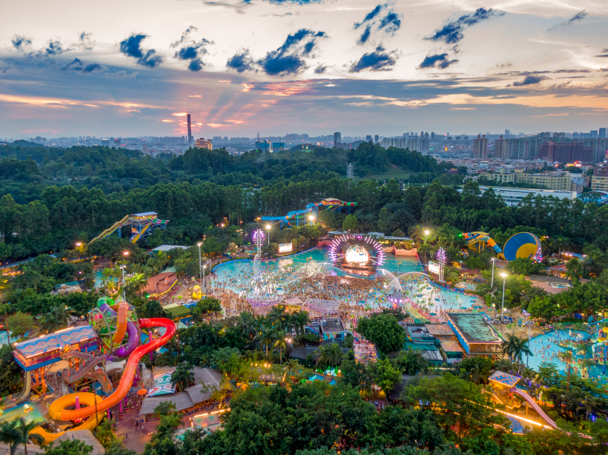
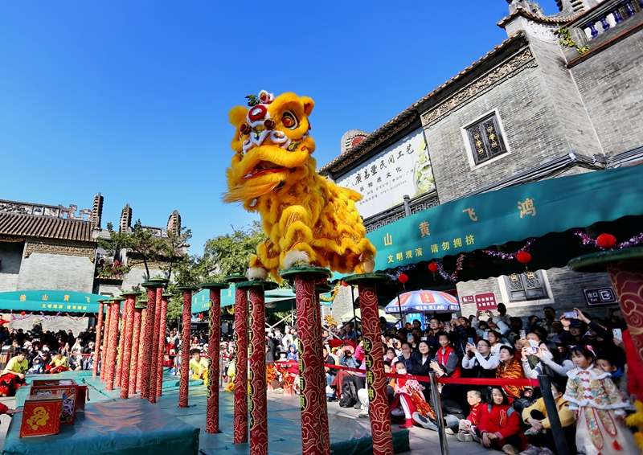
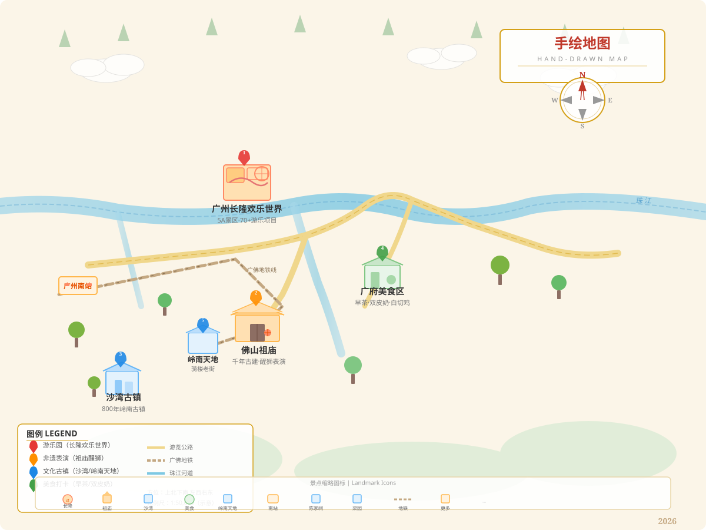

# 广州长隆+佛山醒狮 | 5天4晚游乐园与非遗文化之旅

> **出发地：全国各地 → 广州 | 5天4晚 | 预算约4,000-7,000元/2人 | 夏季出发**

---

## 一、行程总览

| 项目 | 详情 |
|------|------|
| 目的地 | 广州（长隆欢乐世界）+ 佛山（祖庙醒狮） |
| 天数 | 5天4晚 |
| 适宜季节 | 7-8月夏季（气温30-38°C，炎热天气） |
| 预算 | 约4,000-7,000元/2人（1w预算内绰绰有余） |
| 主题 | 游乐园+非遗醒狮+广府美食 |
| 交通 | 高铁/飞机抵达广州，广佛地铁往返 |

**整体节奏：** 宽松不赶路，每天安排1-2个核心景点，预留充足自由探索时间。

---

## 二、逐日行程

### Day 1：抵达广州 → 入住番禺长隆周边

**行程：**
- 抵达广州南站/白云机场
- 地铁7号线至汉溪长隆站（约30分钟）
- 入住长隆周边民宿/酒店
- 傍晚：番禺万达广场周边觅食，推荐银记肠粉、煲仔饭

**当日花销预估：**
| 项目 | 费用 |
|------|------|
| 广州南→汉溪长隆地铁 | 5元/人 |
| 住宿（长隆周边民宿） | 150-250元/晚 |
| 晚餐（煲仔饭+肠粉） | 40元/人 |
| **当日小计** | **约240-340元/2人** |

---

### Day 2：广州长隆欢乐世界（全天）

**行程：**
- 09:00 早餐后出发，步行/打车至长隆欢乐世界北门
- 10:00 开园入场，推荐路线：
  - 十环过山车 → 龙卷风暴 → 火箭过山车（北门开始）
  - 飞天魔轮 → 自由落体 → 超级大摆锤
  - 午餐：园区内餐厅（人均40-50元）
  - 下午：垂直过山车 → 急流勇进（备雨衣）
  - 飞马家庭过山车 → 南门出园
- 18:00-21:00 暑期夜场（可选），夜场演艺+美食市集
- 晚餐：出园后汉溪长隆周边平价粤菜餐厅

**门票信息：**
| 票种 | 价格 |
|------|------|
| 成人标准票 | 250元/人 |
| 青少年票（12-18岁） | 200元/人 |
| 大学生票 | 200元/人 |
| 中高考生票 | 175元/人 |
| 双人票 | 500元/2人 |

> 营业时间：暑期10:00-21:00/22:00

**当日花销预估：**
| 项目 | 费用 |
|------|------|
| 门票（双人票） | 500元/2人 |
| 午餐（园区内） | 80-100元/2人 |
| 晚餐（周边餐厅） | 80元/2人 |
| 住宿 | 150-250元 |
| **当日小计** | **约810-930元/2人** |

---

### Day 3：广州→佛山祖庙 → 醒狮表演 → 岭南天地

**行程：**
- 08:30 早餐后出发，汉溪长隆站乘地铁→广佛线→祖庙站（约50分钟）
- 10:00 **祖庙黄飞鸿纪念馆醒狮场** 观看醒狮表演（第一场10:00-10:40）
  - 高桩采青、梅花桩、武术表演
  - 国家级非遗，佛山文化名片
- 11:00 游览祖庙古建筑群：灵应牌坊→万福台→锦香池→正殿→叶问堂
- 12:00 午餐：祖庙附近"应记云吞面"（鲜虾云吞，人均15元）
- 13:30 逛岭南天地（免费）：骑楼老街、文创小店、咖啡厅
- 14:15 可选看第二场醒狮表演（14:15-14:55）
- 15:00 民信老铺双皮奶+姜撞奶（人均15元）
- 16:00 梁园（岭南四大名园之一，门票10元）
- 18:00 晚餐：天海酒家（佛山老字号，白切鸡/炭烧琵琶鸭，人均50元）
- 19:30 返回广州番禺酒店

**醒狮表演时间：**
- 每天 10:00-10:40 / 14:15-14:55 / 15:30-16:10
- 地点：祖庙黄飞鸿纪念馆醒狮场
- 如遇雨天表演取消，免费观看

**门票信息：**
| 票种 | 价格 |
|------|------|
| 祖庙成人票 | 20元/人 |
| 学生/老人票 | 10元/人 |
| 中高考生（凭准考证） | 半价10元 |

**当日花销预估：**
| 项目 | 费用 |
|------|------|
| 广佛地铁往返 | 20元/人 |
| 祖庙门票 | 20元×2=40元 |
| 午餐（应记云吞面） | 30元/2人 |
| 双皮奶（民信老铺） | 30元/2人 |
| 梁园门票 | 10元×2=20元 |
| 晚餐（天海酒家） | 100元/2人 |
| 住宿 | 150-250元 |
| **当日小计** | **约390-490元/2人** |

---

### Day 4：广州早茶 → 沙湾古镇 → 上下九/北京路

**行程：**
- 09:00 广州老城区早茶体验：陶陶居/点都德/广州酒家
  - 虾饺、凤爪、烧卖、肠粉、叉烧包
  - 人均50-80元，吃到撑
- 11:00 沙湾古镇（免费）：800年岭南古镇，蚝壳墙、留耕堂
  - 地铁3号线至市桥站转公交
  - 尝沙湾姜埋奶、鱼皮角
- 13:00 午餐：沙湾古镇内"沙湾牛奶皇后"（人均30元）
- 15:00 返回市区，陈家祠（岭南建筑瑰宝，门票10元）
- 17:00 上下九步行街/北京路：骑楼老街、购物手信
- 19:00 晚餐：银记肠粉+陈添记鱼皮（人均30元）

**当日花销预估：**
| 项目 | 费用 |
|------|------|
| 早茶 | 100-160元/2人 |
| 沙湾古镇交通 | 20元/2人 |
| 午餐 | 60元/2人 |
| 陈家祠门票 | 10元×2=20元 |
| 晚餐 | 60元/2人 |
| 住宿 | 150-250元 |
| **当日小计** | **约410-570元/2人** |

---

### Day 5：自由活动 → 返程

**行程：**
- 上午：沙面岛（免费欧陆风情建筑群）→ 珠江边散步
- 或：广州塔（小蛮腰）外观打卡，花城广场
- 午餐：惠食佳啫啫煲（人均60元）
- 下午：前往广州南站/白云机场返程
- 手信推荐：鸡仔饼、老婆饼、盲公饼

**当日花销预估：**
| 项目 | 费用 |
|------|------|
| 午餐 | 120元/2人 |
| 交通去高铁站 | 10元/人 |
| 手信 | 100元 |
| **当日小计** | **约240元/2人** |

---

## 三、住宿方案

| 类型 | 位置 | 参考价格 | 推荐 |
|------|------|----------|------|
| 经济民宿 | 汉溪长隆地铁站周边 | 150-200元/晚 | 逸米民宿、花墨公寓 |
| 舒适酒店 | 番禺南村万博 | 200-300元/晚 | 麗枫酒店、巢趣设计美宿 |
| 佛山住宿 | 祖庙/岭南天地附近 | 200-300元/晚 | 全季酒店 |

**推荐方案：** 全程住广州番禺长隆周边（4晚约600-1000元），去佛山当天往返地铁仅需50分钟。

---

## 四、出行贴士

| 类别 | 提示 |
|------|------|
| 优惠证件 | 学生证、中高考准考证享门票优惠 |
| 预约 | 长隆门票提前在官方APP/小程序购买（现场无优惠） |
| 广东文旅消费券 | 7-8月美团App搜"暑假当然来广东"，满减最高省500元 |
| 避坑 | 长隆周边"黄牛票"多半是假票，认准官方渠道 |
| 醒狮 | 提前10分钟到醒狮场占好位置，节假日人很多 |
| 防晒 | 广州夏季紫外线强，SPF50+防晒霜+遮阳帽必备 |
| 雨天 | 7-8月多雷阵雨，随身带折叠伞 |
| 地铁 | 下载"广州地铁"APP，支付宝/微信可直接扫码乘车 |

---

## 五、出行行李清单

| 类别 | 物品 |
|------|------|
| 证件 | 身份证、学生证/准考证 |
| 衣物 | 短袖×4、短裤×2、防晒衣、泳衣（水上乐园）、凉鞋/运动鞋 |
| 防晒 | 防晒霜SPF50+、遮阳帽、墨镜 |
| 雨具 | 折叠伞、雨衣（长隆激流勇进用） |
| 电子 | 充电宝、手机防水袋 |
| 药品 | 藿香正气水（防中暑）、驱蚊液 |
| 其他 | 小背包（游乐园用）、现金少许 |

---

## 六、预算总结

| 项目 | 经济型 | 舒适型 |
|------|--------|--------|
| 往返交通（高铁/飞机） | 1,000-2,000元 | 2,000-3,000元 |
| 住宿（4晚） | 600-800元 | 800-1,200元 |
| 门票（长隆+祖庙+其他） | 560-600元 | 560-600元 |
| 餐饮（5天） | 800-1,000元 | 1,000-1,200元 |
| 市内交通 | 100-150元 | 150-200元 |
| 手信/其他 | 100-200元 | 200-300元 |
| **总计（2人）** | **约3,200-4,800元** | **约4,700-6,500元** |

> 1万元预算绰绰有余，可升级为品质出行（住4钻酒店+天天早茶+长隆双园联票）。

---

## 七、美食推荐（不辣清单）

| 美食 | 推荐店铺 | 人均 |
|------|----------|------|
| 早茶点心 | 陶陶居/点都德/广州酒家 | 50-80元 |
| 肠粉 | 银记肠粉、荔银肠粉 | 15-20元 |
| 双皮奶 | 民信老铺（佛山）/仁信老铺 | 12-15元 |
| 白切鸡 | 清平饭店/天海酒家 | 50-70元 |
| 煲仔饭 | 超记煲仔饭 | 20-30元 |
| 云吞面 | 应记云吞面（佛山） | 12-15元 |
| 啫啫煲 | 惠食佳 | 60-80元 |
| 姜撞奶 | 沙湾牛奶皇后 | 12元 |
| 鱼皮 | 陈添记 | 25元 |
| 烧鹅 | 佛山柴火烧鹅 | 50元 |

---

## 八、景区手绘导览地图

> 样式说明：严格对标国风卡通扁平手绘版式，包含方位罗盘、四色打卡图例、道路水系标注，遵循上北下南方位规则。标注景点：广州长隆欢乐世界、佛山祖庙醒狮、沙湾古镇、岭南天地、广府美食区。

---

## 权威参考链接

- 广州长隆官网：https://www.chimelong.com
- 广州番禺区气象台：http://www.tqyb.com.cn/gzpanyu/
- 佛山市祖庙博物馆：https://content.foshanplus.com
- 佛山市禅城区政府文旅：https://www.chancheng.gov.cn
- 中国政府网醒狮专题：https://www.gov.cn/yaowen/tupian/202502/content_7001945.htm
- 广东省交通运输厅：https://td.gd.gov.cn
- 佛山地铁3号线：https://jtys.foshan.gov.cn
- 广州气象台：http://www.tqyb.com.cn/gz/

> *图片说明：广州早茶点心、佛山双皮奶图片因网络限制未能获取真实实拍图，已使用备用图片占位。广州长隆欢乐世界和佛山祖庙醒狮为官方来源真实图片。*